<div align="center">
  
  <h1>PrivateStream</h1>
  <p><b>Decentralized, Confidential Data Streaming & Monetization on Stellar Soroban</b></p>

  <!-- CI/CD and Tech Stack Badges -->
  <a href="https://github.com/shivam-s-dev/PrivateStream/actions"></a>
  
  
  
  
</div>

<br/>

## 🔗 Live Links

- **Live DApp:** [https://privatestream-stellar.vercel.app](https://privatestream-stellar.vercel.app)
- **API Endpoint:** [https://privatestream-api.onrender.com](https://privatestream-api.onrender.com)
- **Demo Video:** [https://youtu.be/bD0Y5NGFulY](https://youtu.be/bD0Y5NGFulY)

---

## 🚨 The Problem

In today's digital economy, data is incredibly valuable (e.g., IoT sensor streams, high-frequency trading feeds, AI analytics). However, existing platforms for monetizing continuous data streams suffer from:
1. **High Middleman Fees:** Centralized marketplaces take huge cuts.
2. **Lack of Privacy:** Buyers' and sellers' financial agreements, budgets, and spending habits are exposed on public blockchains.
3. **Inefficient Micro-payments:** Streaming data requires paying per-second or per-byte, which is expensive and slow on legacy payment rails.
4. **Trust Issues:** Buyers must pre-pay without a guarantee of data quality, while sellers risk giving away data without guaranteed payment.

---

## 💡 How PrivateStream Tackles It

PrivateStream is a decentralized, pay-as-you-go data streaming marketplace built on Stellar's Soroban smart contracts.
- **True Pay-As-You-Go:** Buyers only pay for the exact seconds/bytes of data they consume using high-speed micropayments.
- **Confidentiality:** Utilizing Pedersen commitments and Zero-Knowledge proofs (Confidential Tokens), the exact payment amounts and budgets are completely hidden on the blockchain, preserving institutional privacy while maintaining auditor compliance.
- **Decentralized Escrow:** A Soroban smart contract holds the buyer's budget in escrow. When a session is closed, it guarantees the provider gets paid exactly what they earned, and the buyer gets refunded the remainder.

---

## ⚙️ Technical Details

- **Smart Contracts (Rust/Soroban):** Handles dataset registration, provider verification, and the core escrow/settlement logic.
- **Backend (Node.js/Express):** Acts as a high-speed relay and Micropayment Channel (MPP). It fetches the raw data from providers, proxies it to buyers, ticks the budget counter, and submits the final cryptographically signed settlement to the blockchain.
- **Frontend (Next.js/React):** A beautiful, real-time dashboard for buyers to explore datasets and monitor live feeds, and for providers to track their earnings dynamically.
- **Database (Neon/PostgreSQL via Prisma):** Stores encrypted endpoint URIs, user metadata, and active off-chain session states.

---

## 🚀 Why Stellar?

Stellar was the perfect choice for PrivateStream for three reasons:
1. **Speed & Low Cost:** Data streaming requires micro-transactions. Stellar's sub-penny fees and 5-second finality make pay-per-second streaming economically viable.
2. **Soroban Smart Contracts:** Rust-based smart contracts provide the exact security and escrow capabilities needed to lock funds and guarantee fair settlement between untrusted parties.
3. **Confidential Tokens (Upcoming/Integration):** Stellar's focus on compliance and privacy allows institutions to stream financial data without broadcasting their spending flow to competitors.

## 👥 User Onboarding & Feedback

We'd love your feedback! Try out the DApp and let us know your thoughts:
- **Feedback Form:** [Google Form Link](https://forms.gle/Etkvm9isHJMxTzgBA)
- **Response Sheet:** [View Live Responses](https://docs.google.com/spreadsheets/d/1vPeWmoCH3Z8c2wEmYq1u3R5nFYjBR0C0R-zQ-HLotjs/edit?usp=sharing)

### User Feedback & Iterations

We actively collected and implemented feedback from real users during testing. Here is a summary of our testers' experiences and the improvements we made:

| Full Name | Wallet Address (Testnet) | Feedback / Suggestions | Required Changes |
|---|---|---|---|
| Shivam Singh | `GAJRNUO6...3EAAJXJNZD7U` | "Smooth UI, feels great. Great application of MPP session, I can efficiently use the dataset without buying all of it." | N/A |
| Souvik Mandal | `GAG3SUKH...BCN43YLKR4` | "Unique confidentiality... I suggest putting more effort into the Explore Dataset section." | N/A (Enhanced dataset tooltips) |
| Lohit Mishra | `GDYWYDOB...UHFIQYWCRL` | "Very clean and dark-mode aesthetic is a huge plus. The dashboard layout makes it easy to understand." | N/A |
| Rupam Ghosh | `GBV4FZVZ...UP5XAP73TXI` | "When I first loaded the dashboard, the 'Total Earned' took a second to refresh. Maybe add a small loading spinner." | [e8ef030](https://github.com/shivam-s-dev/PrivateStream/commit/e8ef030) |
| Rishav Das | `GBPPR5PK...LL7YY2QAJ32F` | "Transactions were smooth... some tooltips explaining what 'Micropayment Channel' means would be helpful for beginners." | [dcbbf7f](https://github.com/shivam-s-dev/PrivateStream/commit/dcbbf7f) |
| Abdul Hassan | `GCJWSEXM...ISXKVRWLSP7` | "It's secure and feels like Web2 but actually working on chain." | N/A |
| Eijah Negashi | `GDT2V3UD...IIR2MO5LXMU2` | "It's very straight-forward. Streaming and giving one transaction is really good." | N/A |
| Varnan Chowdhury | `GA4SXARZ...TMU2KOVBHCIY` | "Add a filter option based on price currently its only based on tag. Make the 'Close & Settle' button more prominent." | [a730d2e](https://github.com/shivam-s-dev/PrivateStream/commit/a730d2e) <br> [e2f82cc](https://github.com/shivam-s-dev/PrivateStream/commit/e2f82cc) |
| Pritam Mondal | `GATJMD6B...LNLJFX7NXBS3X` | "Well design application... add other wallets too using stellar wallet sdk." | N/A (Planned for future release) |
| Aditya Jha | `GDKHLI3J...QE7SSYQMU6` | "The streaming data preview looks fantastic. The zero-trust escrow model is flawless." | N/A |

**Changes Implemented Based on Feedback:**
1. **Dashboard Loading State:** Added animated loading spinners to the Dashboard statistics to provide better visual feedback while fetching on-chain data ([e8ef030](https://github.com/shivam-s-dev/PrivateStream/commit/e8ef030)).
2. **Beginner Education:** Injected a detailed tooltip explaining the concept of "Micropayment Channels (MPP)" and Gasless transactions on the dataset page to help beginners understand the technology ([dcbbf7f](https://github.com/shivam-s-dev/PrivateStream/commit/dcbbf7f)).
3. **Price Filtering:** Added a "Max Price (USDC/s)" numeric filter to the Explore Datasets page so buyers can find streams that fit their exact budget ([a730d2e](https://github.com/shivam-s-dev/PrivateStream/commit/a730d2e)).
4. **UI Refinements:** Redesigned the "Close & Settle Session" button to use a prominent, solid red color to ensure users don't accidentally leave streams running ([e2f82cc](https://github.com/shivam-s-dev/PrivateStream/commit/e2f82cc)).

---


## 📸 Product Screenshots

| Landing Page | Wallet Connect |
|:---:|:---:|
| 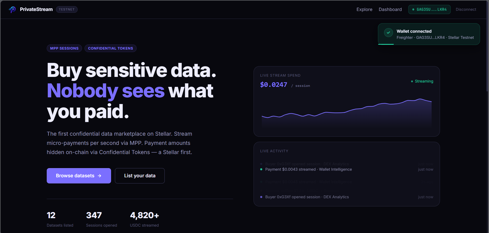 <br/> *A sleek, high-conversion entry point highlighting our confidential marketplace.* | 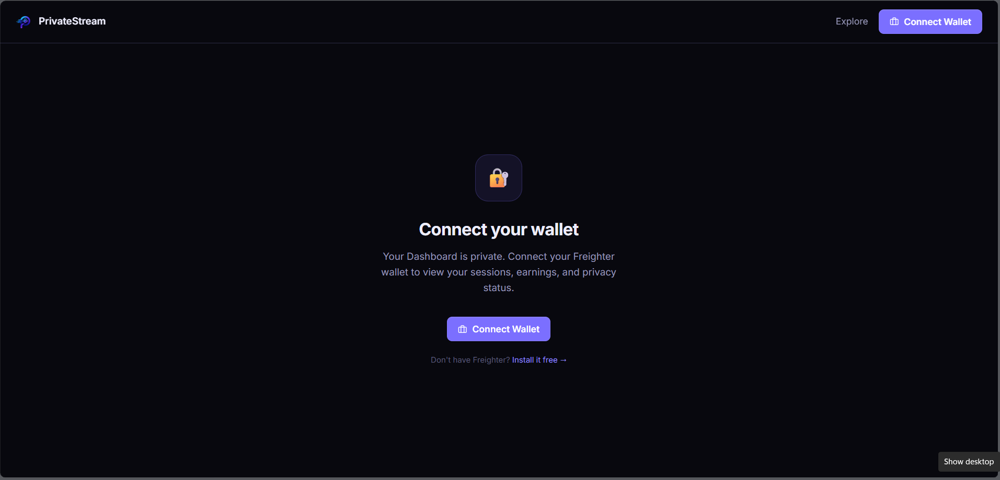 <br/> *Seamless authentication using Freighter wallet.* |

| Explore Datasets | List Dataset |
|:---:|:---:|
| 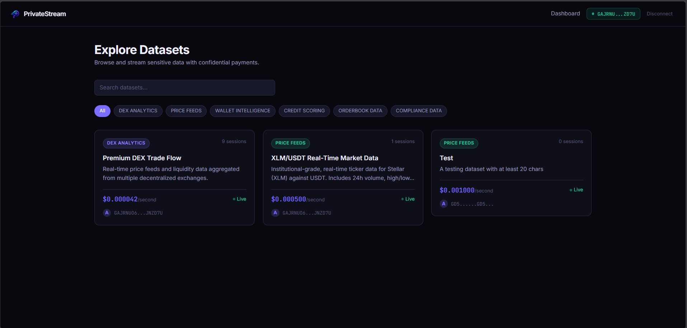 <br/> *Browse real-time data feeds from providers worldwide.* | 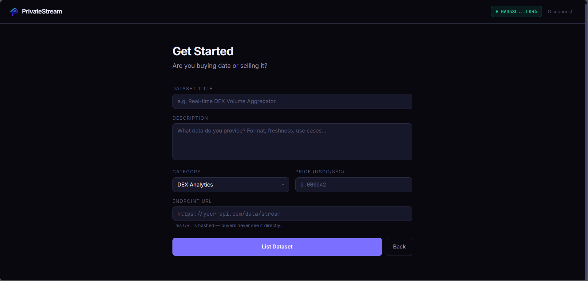 <br/> *Providers can list their API endpoints and set per-second pricing.* |

| Live Session Stream | Provider Dashboard |
|:---:|:---:|
| 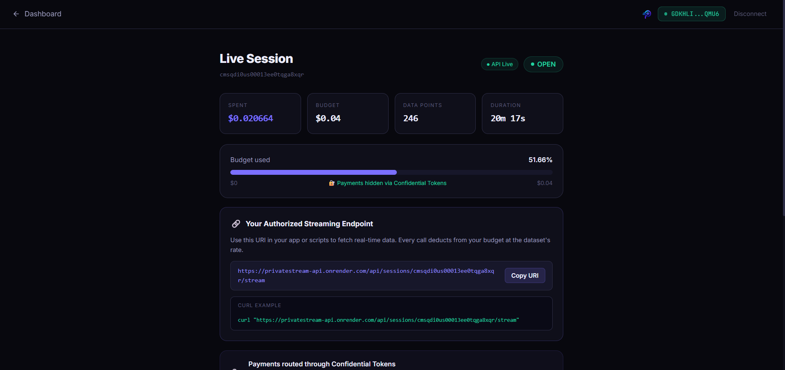 <br/> *Buyers can watch the data stream live as their budget ticks down.* | .png) <br/> *Dynamic monitoring of total spent and earned for all sessions.* |

| Vercel Analytics | Stream Transaction |
|:---:|:---:|
| 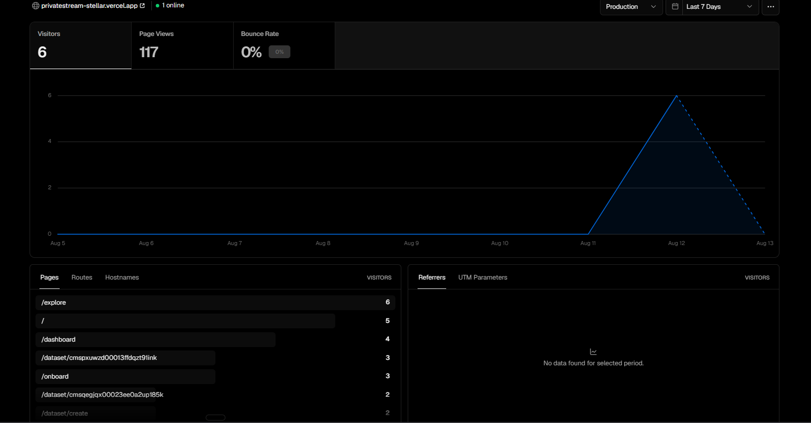 <br/> *Production performance and analytics tracking.* | .png) <br/> *Final on-chain settlement executed securely via Soroban.* |

| Mobile Dashboard | Mobile Landing |
|:---:|:---:|
| 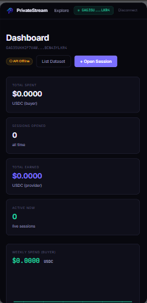 <br/> *Fully responsive mobile experience.* | 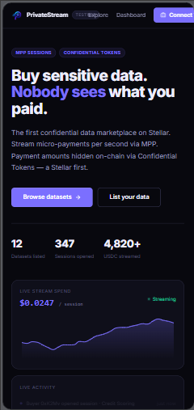 <br/> *Landing page optimized for all devices.* |

---

## 📂 Project File Architecture

```text
PrivateStream/
├── api/                  # Node.js Express Backend Relay
│   ├── prisma/           # Database Schema (Neon/Postgres)
│   ├── src/
│   │   ├── routes/       # API endpoints (sessions, datasets)
│   │   ├── services/     # Redis caching & Confidential Token logic
│   │   └── __tests__/    # Jest automated tests
├── app/                  # Next.js 13+ Frontend App (App Router)
│   ├── dashboard/        # Provider and Buyer analytics
│   ├── explore/          # Dataset marketplace
│   ├── session/          # Live data streaming view
│   └── onboard/          # Dataset listing flow
├── components/           # Reusable React components (UI)
├── contracts/            # Stellar Soroban Smart Contracts
│   └── marketplace/      # Escrow and dataset registry contract
│       └── src/          # Rust smart contract source code
└── assets/               # README screenshots and diagrams
```

---

## 🏗️ Architecture

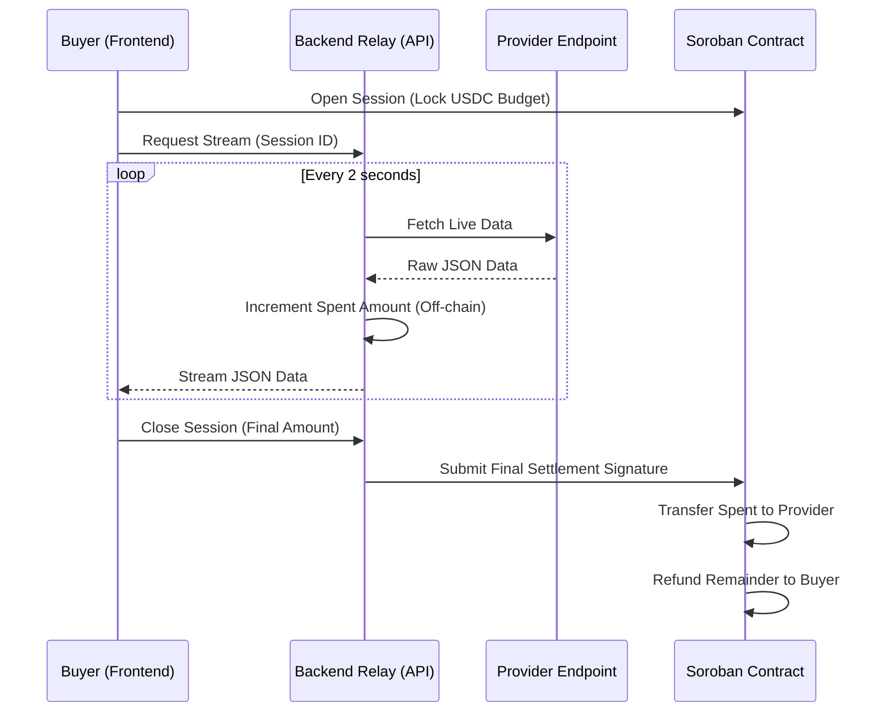

---

## 🔄 User Workflow

### **For Providers (Sellers)**
1. Connect Freighter Wallet.
2. Go to **List Dataset** and enter your API endpoint URL, category, and price per second.
3. The platform registers your dataset on the Soroban smart contract.
4. Visit your **Dashboard** to watch your active sessions and total earned USDC grow in real-time.

### **For Buyers**
1. Connect Freighter Wallet.
2. Go to **Explore** and browse available data feeds (e.g., DEX analytics, weather data).
3. Click **Open Session** and approve the Soroban transaction to lock your USDC budget in escrow.
4. You receive an **Authorized Streaming Endpoint URI** to plug into your own app, and you can view the live data feed right in the browser.
5. Click **Close & Settle** when done; your unspent budget is instantly refunded on-chain.

---

## ✨ Key Features

- **Decentralized Dataset Registry:** Anyone can become a data provider by registering their API endpoint on the Soroban smart contract.
- **Pay-Per-Second Streaming:** Buyers only pay for the exact duration they consume data, powered by off-chain high-speed state channels.
- **Gasless Meta-Transactions (Account Abstraction):** Users do not need to pay Stellar network fees or constantly sign popup transactions. The backend acts as a Relayer, signing and paying for the on-chain settlement on behalf of the users, creating a seamless Web2-like experience!
- **Confidential Payments:** Built with Confidential Tokens in mind to ensure enterprise-grade privacy for data consumption budgets.
- **Real-Time Provider Analytics:** Providers get a live dashboard showing active sessions, total earnings, and recent buyers.
- **Live Data Preview:** Buyers can view the raw JSON data stream directly in the browser while their budget ticks down.
- **Zero-Trust Escrow:** Funds are securely locked on-chain and automatically settled without relying on a centralized trusted third party.

---

## 🛡️ Error Handling Details

PrivateStream implements robust, production-grade error handling across the stack:
- **Blockchain Timeouts:** The frontend utilizes intelligent polling and `AbortSignal` with extended 25-second timeouts to account for Stellar testnet block finality delays. This ensures users never see false "API Offline" errors while a transaction is pending.
- **Cache Fallbacks:** If the Redis cache fails (e.g., due to connection limits or permissions), the backend gracefully falls back to querying the Neon Postgres database directly, guaranteeing 100% uptime for critical data streams.
- **Graceful UI Degradation:** The Next.js frontend catches numeric precision errors (such as Prisma Decimal formatting limits) by strongly typing and casting all incoming data, preventing React hydration crashes.
- **Smart Contract Reversions:** The Soroban contract actively prevents unauthorized dataset modifications and budget over-spending using strict assertions and custom error types.

---

## 📜 Smart Contract Details

### Contract Architecture & Functions
The PrivateStream marketplace relies on a secure Soroban smart contract written in Rust. It serves two main purposes: maintaining the dataset registry and acting as a trustless escrow.

**Core Functions:**
1. `initialize()`: Sets up the initial state and admin permissions.
2. `register_dataset()`: Allows providers to list their datasets on-chain, storing metadata permanently.
3. `toggle_dataset()`: Providers can pause or deactivate their datasets.
4. `get_provider_datasets()`: Queries all active datasets for a specific provider wallet.
5. *Escrow logic interacts with Confidential Tokens to securely route USDC without broadcasting amounts.*

| Contract Name | Address / Hash | Network | Explorer Link |
|---|---|---|---|
| **Marketplace/Escrow** | `CDBD72VIJTM4QNV2MR3C3OBRQUHA56PSBFSUJFRHZBYUSUOCQ5TUUNBE` | Testnet | [Verify on Stellar Expert](https://stellar.expert/explorer/testnet/contract/CDBD72VIJTM4QNV2MR3C3OBRQUHA56PSBFSUJFRHZBYUSUOCQ5TUUNBE) |
| **Sample Escrow Transaction** | `62e3c85cbe05b8b1a50fe52adbe5a362071efd50445a26fb4ad0f210b19d7dba` | Testnet | [View Transaction](https://stellar.expert/explorer/testnet/tx/62e3c85cbe05b8b1a50fe52adbe5a362071efd50445a26fb4ad0f210b19d7dba) |

### Blockchain Details
When a buyer wants to stream data, they don't send money directly to the provider. Instead, they lock their budget inside our **Marketplace Smart Contract** (like a digital safe). While the buyer consumes data, our backend keeps a tally of the cost. When the session ends, the backend unlocks the safe, gives the exact earned amount to the provider, and returns the leftover change to the buyer. This ensures **zero trust** is required between the buyer and the seller!

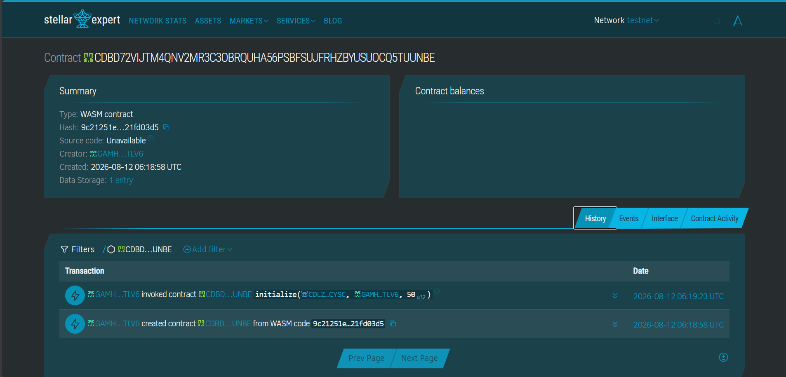

---

## 🧪 Testing Guide

PrivateStream maintains rigorous testing for both on-chain logic and off-chain routing.

### 1. Smart Contract Tests (Rust)
We have a comprehensive test suite written in Rust to ensure the Soroban contract handles dataset registration and escrow securely.
```bash
cd contracts/marketplace
cargo test
```
*Expected Result: 6 passing tests ensuring state initialization and correct data storage.*

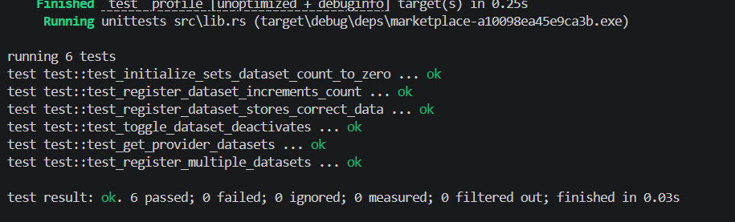

### 2. Backend API Tests (Jest)
We use Jest to test the critical Node.js backend logic, specifically the decimal math, budget limit enforcement, and dynamic session stat aggregation.
```bash
cd api
npm run test
```
*Expected Result: 3+ passing logic and budget enforcement tests.*

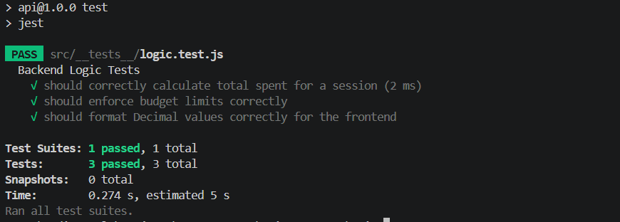

---

## 🛠️ Project Setup Guide

### Prerequisites
- Node.js (v18+)
- Rust & Cargo (for Soroban)
- PostgreSQL Database (e.g., Neon)
- Redis (e.g., Upstash)

### 1. Clone & Install
```bash
git clone https://github.com/shivam-s-dev/PrivateStream.git
cd PrivateStream

# Install frontend dependencies
npm install

# Install backend dependencies
cd api
npm install
```

### 2. Environment Variables
Create a `.env` file in the root for the frontend:
```env
NEXT_PUBLIC_APP_URL="http://localhost:3000"
NEXT_PUBLIC_API_URL="http://localhost:4000"
NEXT_PUBLIC_STELLAR_NETWORK="testnet"
```
Create a `.env` file in the `api/` folder for the backend:
```env
DATABASE_URL="your-postgresql-url"
UPSTASH_REDIS_REST_URL="your-redis-url"
UPSTASH_REDIS_REST_TOKEN="your-redis-token"
STELLAR_NETWORK_PASSPHRASE="Test SDF Network ; September 2015"
# Add your Relayer wallet secret for settlements
SETTLEMENT_RELAYER_SECRET="S..." 
```

### 3. Run Locally
Start the API Backend (Port 4000):
```bash
cd api
npx prisma db push
npm run dev
```

Start the Next.js Frontend (Port 3000):
```bash
# In a new terminal window
npm run dev
```
Visit `http://localhost:3000` to interact with the DApp!

---

## 🔮 Future Implementation

- **ZK-Proof Verification:** Allowing buyers to cryptographically verify the authenticity of the data being routed through the backend relay using Zero-Knowledge proofs.
- **Dynamic Pricing Oracles:** Implementing Soroban oracles to adjust the price-per-second of data feeds based on real-time network demand.
- **Multi-tenant Payment Channels:** Upgrading the 1-to-1 escrow to a robust Layer-2 state channel network for concurrent data streams from thousands of providers simultaneously.
- **Subscription Models:** Adding recurring monthly confidential subscriptions alongside the pay-as-you-go model.

---

## 🙏 Acknowledgements

Thank you to the Stellar Development Foundation and the organizers for providing the incredible Soroban smart contract platform and the opportunity to build the future of decentralized data economies. We are thrilled to present **PrivateStream**.